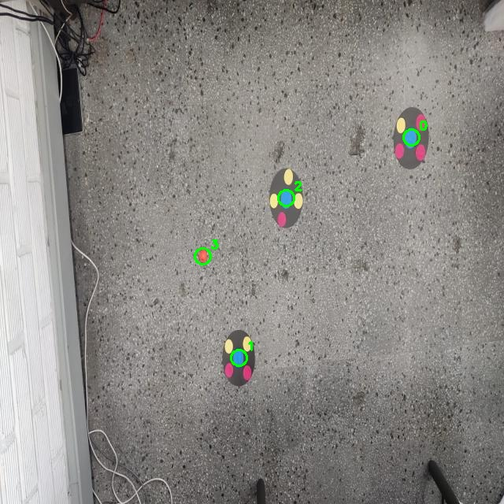

# Proyecto Robocup Soccer 

Primera versión del software para detección de robots según su ID y la pelota.


## Retorna
 Además de la predicción se extraen los datos de cada objeto en el siguiente formato : 

```json
{
  "robot": [x, y, ángulo],
  "pelota": [x, y],
  "objetos": [ [x, y], [x, y], ...]
}
