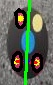

# Proyecto Robocup Soccer  - Vision Software

Primera versión del software para detección de robots según su ID y la pelota.


Una vez el modelo identifica el robot, se realizar un procesamiento de imagen en el espacio HSV para extraer los puntos y detectar el frente del robot. Esto con el fin de encontrar el ángulo de inclinación que tiene. 


## Retorna
 Además de la predicción se extraen los datos de cada objeto en el siguiente formato : 

```json
{
  "robot": [x, y, ángulo],
  "pelota": [x, y],
  "objetos": [ [x, y], [x, y], ...]
}
