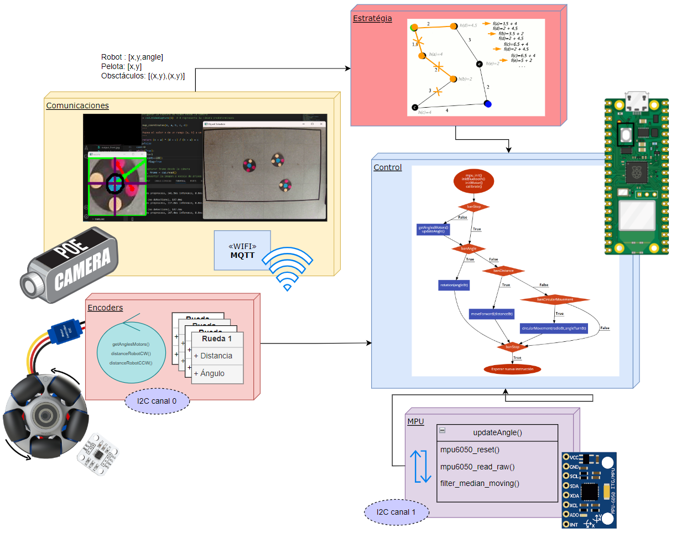
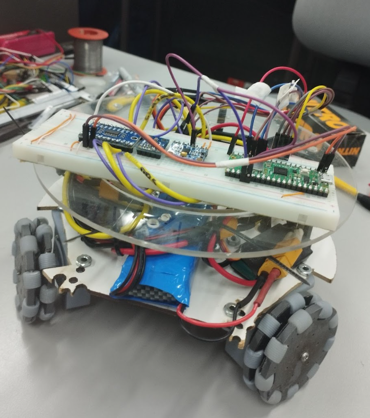

# Proyecto Robocup Soccer SSL-C

### Lógica del funcionamiento 

## Objetivos

- Implementar el sistema mecánico que permite a un robot de la liga SSL de Robocup desplazarse en el campo de juego de forma rápida y eficiente.
- Desarrollar el firmware para ejecutar los movimientos básicos del robot: giros sobre su propio eje y desplazamientos en línea recta.
- Desarrollar una aplicación móvil que permita demostrar los movimientos del robot.

### Movimientos a Implementar
- Girar sobre su propio eje un ángulo determinado.
- Desplazamiento en línea recta para diferentes direcciones con relación al frente del robot y durante una distancia determinada.
- Desplazamiento circular con un radio determinado.

## Desarrollo del Proyecto

### Estructura del Repositorio

El repositorio está organizado en varias ramas, cada una correspondiente a una parte específica del proyecto. A continuación, se proporciona una visión general de la estructura y el desarrollo en cada una de las áreas clave.

### Rama 'Odometría'

La rama 'Odometría' contiene el desarrollo del firmware para la Raspberry Pi Pico. El archivo `main.c` es el punto central de este desarrollo. En este archivo, se implementan las funciones y lógica para los movimientos del robot, como giros y desplazamientos. Es necesario comprender que el códgio se divide por secciones. Se crearon archivos por aparte para el control de los motores correspondiente a 'motor_config', lectura de datos de los encoders 'encoder', lectura de la mpu 'MPU6050_I2C', control del robot por movimiento 'robot_movement' y las funciones de control PD para los movimientos del motor 'control_functions'. Cabe reslatar que esta rama ya cuenta con la implementación de la telemetría.

### Rama 'freeRTOS'

Esta rama contiene el desarrollo del firmware para la Raspberry Pi Pico de la base de odometría pero implementada en un sistema de tiempo real. Además de reorganizar toda la estructura anterior se deben dividir los procesos en tareas y adicionar las funcionalidades de dribble y peteo de la pelota.

### Rama 'Estratégia'

Esta rama contiene el desarollo del algortimo de encontrar el camino óptimo para que el robot se desplace de un punto al otro en busca de la pelota, evitando los obstaculos que se encuentren en su camino. Los parámetros que tiene este algoritmo son las posiciones iniciales del robot, pelota y obstáculos. 

### Rama 'MQTT'

Contiene el desarollo para el protocolo de comunicación para el uso de WIFI en la Raspbeerry Pi Pico W.

### Rama 'Telemetría'

La rama 'Telemetría' aborda la implementación de la telemetría del robot por medio de Bluetooth BLE. Se encuentran archivos como `bt_functions.c` y `bt_functions.h`, los cuales se utilizan para transmitir las instrucciones de movimiento al robot.

### Rama 'App'

En la rama 'App', se desarrolla la aplicación móvil. Aquí, se encuentran los archivos relacionados con la interfaz gráfica de usuario (GUI) y la lógica de comunicación mediante Bluetooth por medio de la herramienta MIT APP inventor. Adicionalmente se encuentra la aplicación lista para su descarga con el nombre 'BLE_Robocup_v3.apk'

### Rama 'Mecánica'

En la rama 'Mecánica', se encuentran todos los archivos relacionados con el diseño mecánico del robot. Los archivos CAD, tales como la carpeta `rueda` y `dribble`, están disponibles para la impresión 3D. Adiconalmente se explica el sistema a implementar en el caso de dribble.

### Rama 'SSL'

Es la úlima rama con la actialización de la implementación de todos los sistemas juntos en las Raspberry Pi Pico W, desde la visión, estratégia y demás componentes

### Montaje físico actual

