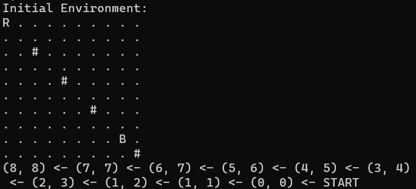

# Estrategia de juego
Esta rama tiene que ver con todo lo relacionado con la estrategia de juego y como se realiza el control autonomo del robot a partir de las coordenadas obtenidas por el sistema de visión.

## Planeacion de ruta
Basado en las coordenadas del robot, los obstaculos y la pelota, se implementa un algoritmo de busqueda que encuentra el camino mas adecuado para llevar el robot hasta la pelota. Se usa el algoritmo A* (A-star) para llevar a cabo dicha tarea. La ruta permite movimientos verticales, horizontales y diagonales en la malla de nodos disponibles.

## Algoritmo A*
El algoritmo A* ) es un algoritmo popular de búsqueda utilizado para encontrar caminos en gráficos como mapas o redes. Combina aspectos de los algoritmos de búsqueda más sencillos, como el de Dijkstra y el algoritmo de búsqueda primero el mejor (Best-First Search), para encontrar de manera eficiente el camino más corto entre un punto inicial y un punto final. La idea es ajustar la ruta desde el nodo inicial hasta el nodo final basandose en la superposicion de dos costos: el costo desde el nodo inicial hasta el nodo n, y el costo desde el nodo actual hasta el nodo objetivo. Este ultimo, llamado como costo heuristico se basa en una suposicion inteligente que es ajustada por los interes del programador. En este caso, debido a que el costo de la ruta se basa en las distancias mapeadas desde el sistema de vision, se usa como heuristica la distancia euclidiana.

## Pasos del Algoritmo A*

### Inicialización:
- Comienza en el nodo de inicio.
- La lista abierta contiene nodos a ser evaluados.
- La lista cerrada contiene nodos ya evaluados.

### Iteración:
- Evalúa los nodos vecinos del nodo actual.
- Calcula los costos de cada vecino (costo real `g` y costo heurístico `h`).

### Cálculo de Costos:
- **g(n)**: El costo del camino desde el nodo inicial hasta el nodo `n`.
- **h(n)**: Costo estimado heurístico desde el nodo `n` hasta el nodo objetivo.
- **f(n) = g(n) + h(n)**: Función de costo total.

### Elección del Siguiente Nodo:
- Selecciona el nodo con el menor costo `f` de la lista abierta.
- Mueve ese nodo a la lista cerrada.

### Repetición:
- Repite los pasos 2 a 4 hasta que el nodo objetivo se encuentre o la lista abierta esté vacía.

### Reconstrucción del Camino:
- Si se encuentra el nodo objetivo, reconstruye el camino retrocediendo desde el nodo objetivo hasta el nodo inicial.

## Ejemplo de ruta encontrada
En la cuadricula generada para observar la ruta generada '.' representan nodos libres, 'R' dimensiones del robor, '#' dimensiones de los obstaculos y 'O' los nodos de la ruta tomada por el robot. La ruta encontrada se mapea a un arreglo de movimientos que luego serán ejecutados por el robot.

