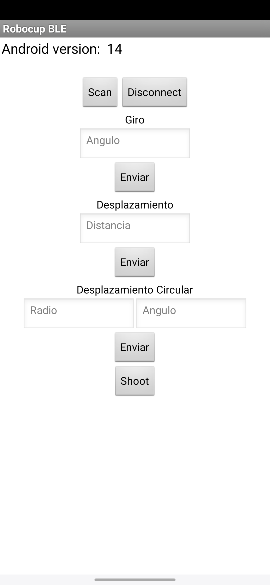

# Robocup

Esta aplicacion permite indicar al robot de forma inalambrica que moviemientos realizar. Para realizar el envio de comandos desde un smartphone Android Version 12 hasta el robot, se utiliza tecnologia Bluetooth BLE.
La aplicación es diseñada usando MIT AppInventor y consta de diferentes secciones. La primera permite el escaneo, conexión y desconexión de la Raspberry Pi Pico W al dispositivo movil usando BT BLE. 
Las siguientes corresponden al envio de valores para los diferentes tipos de movimientos:

+ **Giro**: recibe un entero correspondiente a el angulo de giro en grados.
+ **Desplazamiento**: se indica con un entero la cantidad de metros que el robot debe desplazarse en linea recta.
+ **Circular**: se indica radio y angulo del movimiento, el cual consiste en describir una circunferencia.
+ **Disparo**: adicionalmente se implementa un boton para realizar la acción de pateo.

## Instrucciones de uso.

1. Presionar el botón Scan
2. Comprobar la deteccion de la Raspberry en la lista desplegada y presionarla.
3. Presionar el botón Connect.
4. Escribir los diferentes valores para cada movimiento y presionar el boton Enviar.

