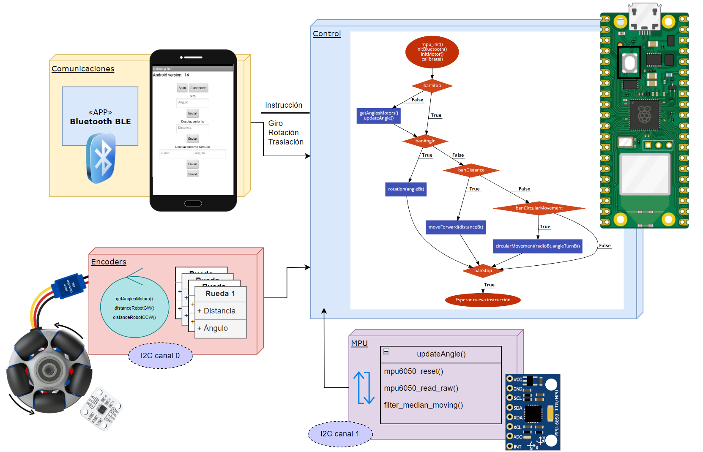

# Control del Movimiento de un Robot Robocup

Este proyecto incluye código para controlar el movimiento de un robot utilizando un sistema embebido. El sistema involucra circuitos electrónicos y control digital.

## Diagrama del funcionamiento general del código

## Descripción de Archivos

- `main.c`: El archivo de control principal que contiene la lógica para el movimiento del robot, la inicialización de los sensores y la comunicación Bluetooth.

- `robot_movement.h` y `robot_movement.c`: Archivos que contienen funciones para controlar el movimiento del robot, incluyendo rotación, movimiento hacia delante, movimiento circular y actualizaciones del ángulo giroscópico.

- `control_functions.h` y `control_functions.c`: Archivos con funciones para calcular distancias, velocidades y afinar las velocidades de los motores.
  
- `MPU6050_i2c.h` y `MPU6050_i2c.c`: Contiene funciones para inicializar la comunicación I2C con el MPU6050, leer datos crudos del acelerómetro y el giroscopio, y filtrar los datos del giroscopio.

- `motor_config.h` y `motor_config.c`: Proporciona funciones para inicializar y configurar la señal PWM utilizada para controlar los motores del robot.

- `encoder.h` y `encoder.c`: Contiene funciones para inicializar la comunicación I2C con los encoders AS5600, leer el ángulo crudo de los encoders, seleccionar canales en un multiplexor TCA9548A, obtener y convertir el ángulo raw a grados.

- `bt_functions.h` y `bt_functions.c`: Archivos con funciones relacionadas con la configuración y manejo de Bluetooth.
  
