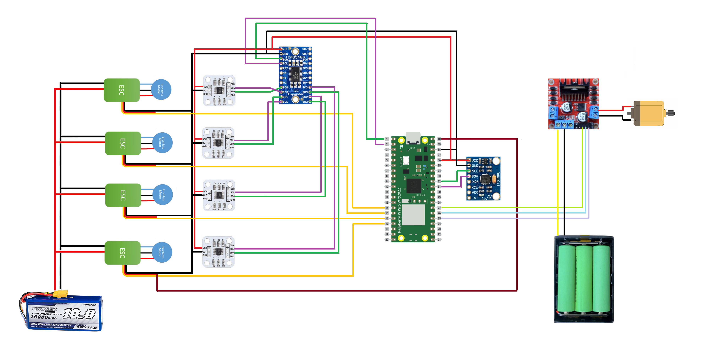

# Robocup
La implementación realizada usa 4 motores brushless controlados por un ESC cada uno, los cuales son alimentados con una bateria Li-Po 3S. Los pines de PWM de los controladores de velocidad son conectados a la Raspberry Pi Pico que se alimenta usando una de las salidas de 5V de uno de los ESC. Ademas, se usan encoders AS5600 para medir el angulo de giro de los motores, un multiplexor I2C TCA9548A y una MPU6050 para la lectura de aceleracion angular y lineal. El sistema de dribbling se implementa usando un motor DC controlado po un puente H L298N y es alimentado con 3 baterias 18650 en serie.

El sistema se diseña en una placa PCB para optimizar el espacio y facilitar el montaje del robot.

