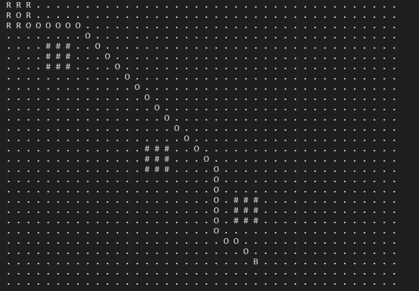

# Estrategia de juego
Esta rama tiene que ver con todo lo relacionado con la estrategia de juego y como se realiza el control autonomo del robot a partir de las coordenadas obtenidas por el sistema de visión.

## Planeacion de ruta
Basado en las coordenadas del robot, los obstaculos y la pelota, se implementa una version actualizada del algoritmo que encuentra el camino mas adecuado para llevar el robot hasta la pelota. Se usa el algoritmo A* (A-star) para llevar a cabo dicha tarea. La ruta permite movimientos verticales, horizontales y diagonales en la malla de nodos disponibles.

### Progreso actual

